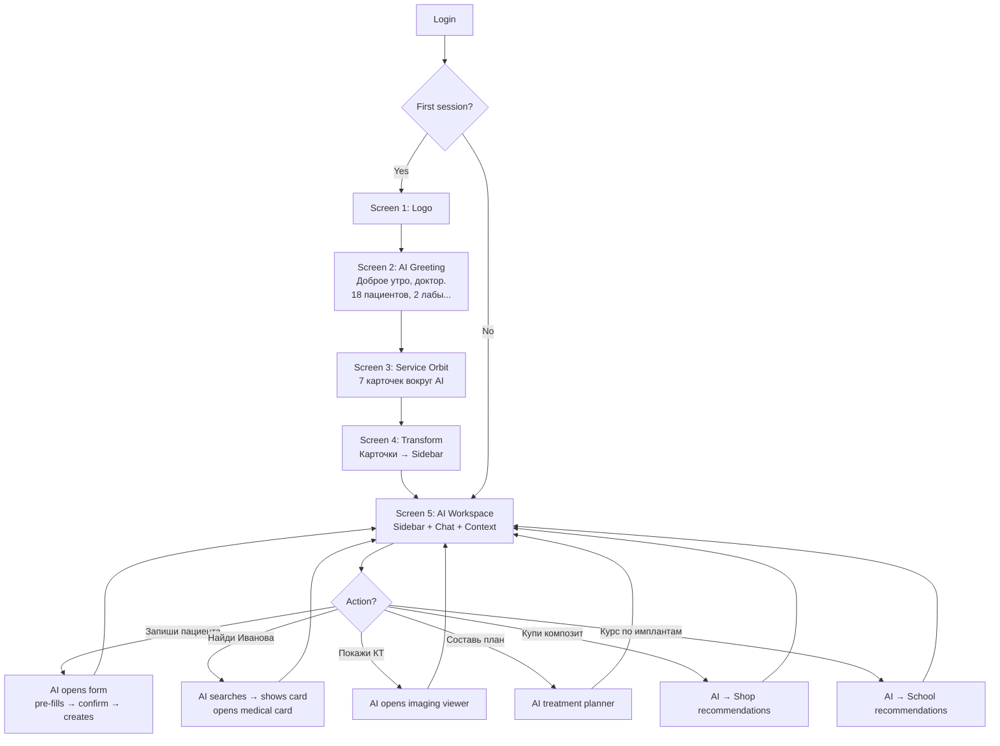
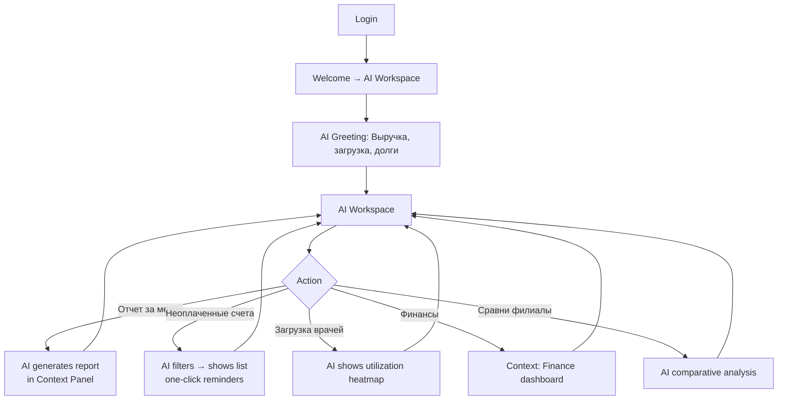
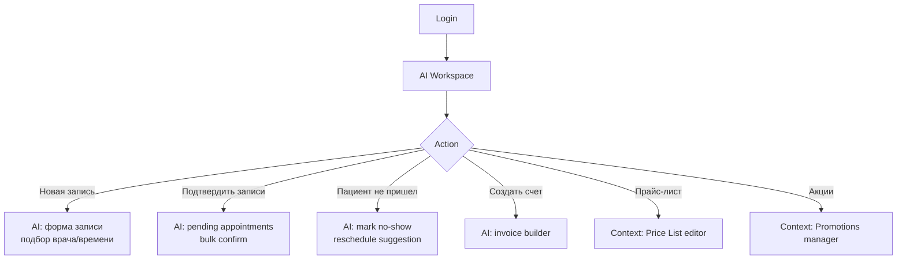
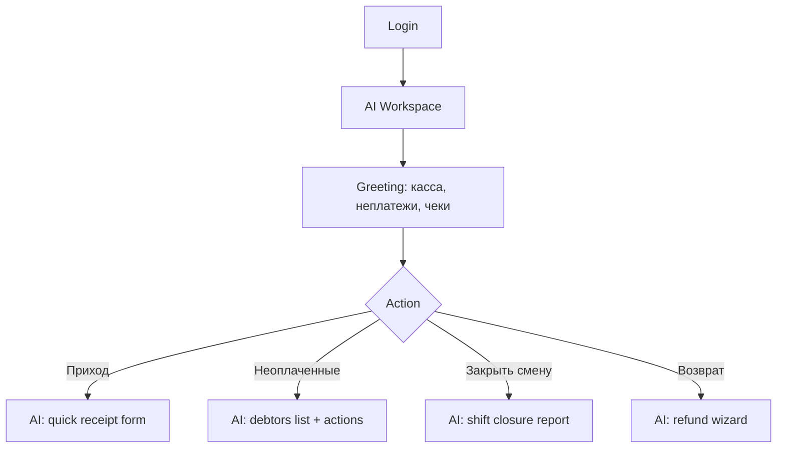
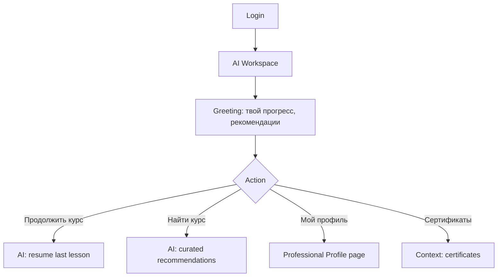
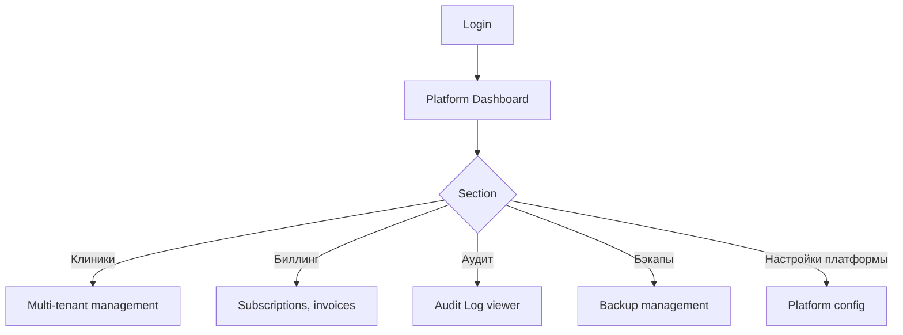
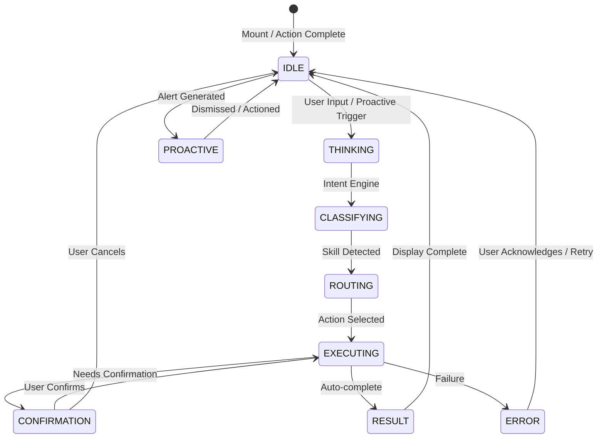
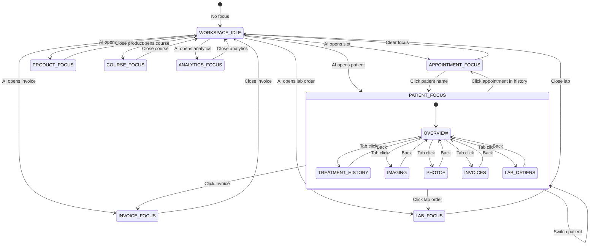
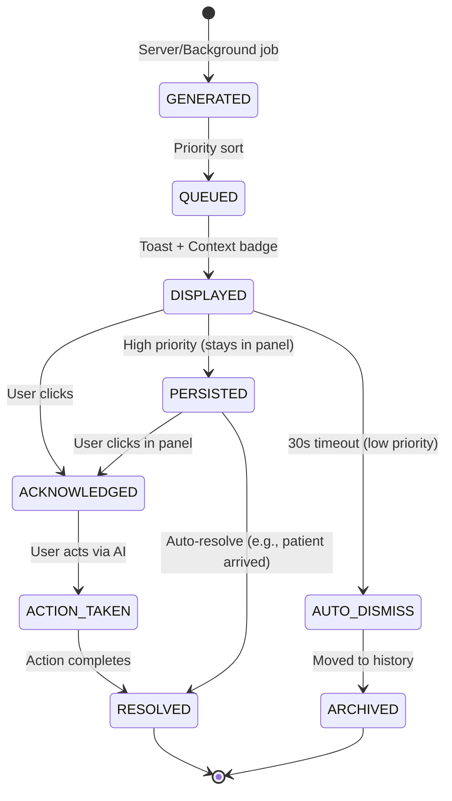

# DENTVISION PLATFORM V2 — AI WORKSPACE BLUEPRINT

**Версия:** 1.0  
**Статус:** ОБЯЗАТЕЛЬНЫЙ К ИСПОЛНЕНИЮ  
**Дата:** 2026-01-16

---

## IMPORTANT — ПРИНЦИПЫ

| ЗАПРЕЩЕНО | РАЗРЕШЕНО (как ориентир качества) |
|-----------|-----------------------------------|
| Придумывать собственный UX | ChatGPT — качество диалога |
| Типичный Dashboard | Kaspi — качество финтех UX |
| Шаблон CRM | Notion — качество workspace |
| Классическая админ-панель | Linear — качество motion |
| Копировать ChatGPT | Vercel — качество детализации |
| Копировать Kaspi | Arc Browser — качество инноваций |

**Концепция:** DentVision = интеллектуальная ОС стоматологии.  
**Ощущение:** "Я вошел в цифрового помощника", НЕ "Я вошел в CRM".

---

## 1. SCREEN MAP — ПОЛНАЯ КАРТА ЭКРАНОВ

```
┌─────────────────────────────────────────────────────────────────────────────┐
│                        DENTVISION SCREEN MAP                                │
└─────────────────────────────────────────────────────────────────────────────┘

ONBOARDING / AUTH
├── /login                    → Login Screen
├── /forgot-password          → Forgot Password
├── /book/:clinicId           → Public Booking (patient-facing)
├── /sign/:token              → Document Signing
└── /my-clinics               → Workspace Selection (если нет активной клиники)

──────────────────────────────────────────────────────────────────────────────
AI-FIRST WORKSPACE (ROOT LAYOUT: /)
│
├── SCREEN 1: Welcome Animation (только первый вход сессии)
│   └── / (index) → WelcomeAnimation → переходит к SCREEN 2
│
├── SCREEN 2: AI Intelligence Greeting
│   └── / (index) → AI Greeting Area (большая область, не чат)
│
├── SCREEN 3: Service Orbit (карточки вокруг AI)
│   └── / (index) → 7 glass cards orbiting AI center
│
├── SCREEN 4: Transform → Sidebar Assembly
│   └── / (index) → cards shrink → fly left → become navigation
│
├── SCREEN 5: AI WORKSPACE (основной интерфейс)
│   ├── Layout: [Sidebar] [AI Workspace] [Context Panel]
│   ├── AI Workspace = центральный объект (не чат!)
│   └── URL: / (index route)
│
├── NAVIGATION DESTINATIONS (из Sidebar)
│   ├── /crm                    → CRM Workspace Selector → Clinic Context
│   │   ├── /crm/schedule       → Schedule (AI-managed)
│   │   ├── /crm/patients       → Patients (AI search)
│   │   ├── /crm/medical-card   → Medical Card (AI context)
│   │   ├── /crm/visits         → Visit Journal
│   │   ├── /crm/lab            → Lab Orders
│   │   ├── /crm/documents      → Documents
│   │   ├── /crm/cashier        → Cashier/Finance
│   │   ├── /crm/pricelist      → Price List
│   │   ├── /crm/inventory      → Inventory
│   │   ├── /crm/promotions     → Promotions
│   │   ├── /crm/staff          → Staff Management
│   │   └── /crm/icd10          → ICD-10 Reference
│   │
│   ├── /shop                   → Marketplace (AI-curated)
│   │   ├── /shop/:id           → Product Detail
│   │   ├── /shop/checkout      → Checkout
│   │   ├── /shop/orders        → Orders History
│   │   ├── /shop/favorites     → Favorites
│   │   └── /shop/suppliers     → Suppliers
│   │
│   ├── /school                 → Academy (AI learning path)
│   │   └── /school/:id         → Course Detail
│   │
│   ├── /ai                     → AI Team (specialized agents)
│   ├── /analytics              → Analytics (AI-generated insights)
│   ├── /jobs                   → Vacancies / HR
│   ├── /community              → Professional Community
│   ├── /profile                → Professional Profile (not settings!)
│   └── /settings               → System Settings
│
├── PLATFORM ADMIN (superadmin only)
│   ├── /admin                  → Platform Dashboard
│   ├── /admin/shop             → Shop Admin
│   ├── /admin/school           → School Admin
│   ├── /audit                  → Audit Log
│   └── /backup                 → Backup Management
│
└── CROSS-CUTTING
    ├── /profile                → Professional Profile Page
    └── /settings               → Settings (global)
```

---

## 2. USER FLOWS ПО РОЛЯМ

### 2.1 РОЛИ В СИСТЕМЕ

| Роль | Описание | Ключевой фокус | Доступ |
|------|----------|----------------|--------|
| **owner** | Владелец клиники | Бизнес-метрики, стратегия | Full + Finance + Analytics |
| **doctor** | Врач-стоматолог | Пациенты, лечение, расписание | CRM + Medical + School |
| **assistant** | Ассистент врача | Записи, подготовка, стерилизация | CRM (schedule, patients) |
| **admin** | Администратор клиники | Операционка, записи, касса | CRM (full) + Cashier |
| **cashier** | Кассир | Платежи, счета, чеки | CRM (cashier) + Finance |
| **lab** | Лаборант/техник | Лабораторные заказы | CRM (lab) |
| **manager** | Менеджер клиники | KPI, загрузка, маркетинг | CRM + Analytics |
| **student** | Студент/интерн | Обучение, курсы, прогресс | School + Profile |
| **superadmin** | Платформенный админ | Мультитенантность, биллинг | Platform Admin |

---

### 2.2 USER FLOW: DOCTOR (ВРАЧ) — ОСНОВНОЙ



---

### 2.3 USER FLOW: OWNER (ВЛАДЕЛЕЦ)



---

### 2.4 USER FLOW: ADMIN / RECEPTION (АДМИНИСТРАТОР)



---

### 2.5 USER FLOW: CASHIER (КАССИР)



---

### 2.6 USER FLOW: STUDENT / INTERN (СТУДЕНТ)



---

### 2.7 USER FLOW: SUPERADMIN



---

### 2.8 USER FLOW: WORKSPACE SELECTION (НЕТ АКТИВНОЙ КЛИНИКИ)

```mermaid
flowchart TD
    A[Login] --> B{Active clinic?}
    B -->|No| C[/my-clinics]
    C --> D[Workspace Selector]
    D --> E{Action}
    E -->|Create| F[Create Clinic Wizard<br/>Name, type, address, plan]
    E -->|Join| G[Join by Invite Code]
    E -->|Demo| H[Load Demo Clinic]
    F --> I[Clinic Created → Onboarding]
    G --> I
    H --> I
    I --> J[Screen 1: Welcome Animation]
```

---

## 3. INFORMATION ARCHITECTURE

### 3.1 НАВИГАЦИОННАЯ ИЕРАРХИЯ

```
LEVEL 0: AI WORKSPACE (Root /)
    │
    ├── LEVEL 1: SERVICE DOMAINS (Sidebar items)
    │   ├── CRM (Clinical Operations)
    │   ├── Shop (Marketplace)
    │   ├── School (Academy)
    │   ├── AI Team (Specialized Agents)
    │   ├── Analytics (Insights)
    │   ├── Jobs (HR)
    │   ├── Community (Network)
    │   └── Profile (Professional Identity)
    │
    ├── LEVEL 2: CRM SUB-DOMAINS (context-aware)
    │   ├── Schedule (Time)
    │   ├── Patients (People)
    │   ├── Medical Card (Clinical)
    │   ├── Visits (History)
    │   ├── Lab (Orders)
    │   ├── Documents (Paperwork)
    │   ├── Cashier (Money)
    │   ├── Pricelist (Catalog)
    │   ├── Inventory (Stock)
    │   ├── Promotions (Marketing)
    │   ├── Staff (Team)
    │   └── ICD-10 (Reference)
    │
    ├── LEVEL 2: SHOP SUB-DOMAINS
    │   ├── Catalog (Browse)
    │   ├── Product Detail
    │   ├── Checkout
    │   ├── Orders
    │   ├── Favorites
    │   └── Suppliers
    │
    ├── LEVEL 2: SCHOOL SUB-DOMAINS
    │   ├── Catalog
    │   ├── Course Detail
    │   ├── My Learning
    │   ├── Certificates
    │   └── Career Path
    │
    └── LEVEL 2: PLATFORM (superadmin)
        ├── Clinics
        ├── Billing
        ├── Audit
        └── Backup
```

### 3.2 КОНТЕКСТНАЯ ПАНЕЛЬ (Right Panel) — ПРАВИЛА

| Контекст (Center) | Содержимое Context Panel |
|-------------------|--------------------------|
| AI Workspace (idle) | Today: Schedule, Alerts, Quick Actions, AI Tips |
| Patient Search | Patient Card Preview, Quick Actions |
| Open Patient | Treatment History, Imaging, Photos, Invoices, Lab |
| Schedule Slot | Appointment Details, Patient Info, Quick Actions |
| Shop Product | Specs, Reviews, Alternatives, AI Recommendation |
| School Course | Curriculum, Progress, Instructor, Certificate |
| Analytics View | Drill-down Filters, Export, AI Insight |
| Invoice/Receipt | Payment Status, Items, Patient, Actions |
| Lab Order | Status, Files, Timeline, Communication |

**Правило:** Context Panel НИКОГДА не пуста. Всегда показывает релевантную информацию для текущего фокуса в AI Workspace.

---

### 3.3 AI WORKSPACE STATE MACHINE

```
┌─────────────────────────────────────────────────────────────────┐
│                    AI WORKSPACE STATES                          │
└─────────────────────────────────────────────────────────────────┘

    ┌──────────────┐
    │   IDLE       │ ← Initial после Screen 4
    │  (awaiting)  │
    └──────┬───────┘
           │ user input / proactive
           ▼
    ┌──────────────┐
    │  THINKING    │ ← AI processes intent
    │  (spinner)   │
    └──────┬───────┘
           │ intent resolved
           ▼
    ┌──────────────────┐
    │  EXECUTING       │ ← AI performs action
    │  (progress)      │   (form fill, search, nav)
    └────────┬─────────┘
             │ action complete
             ▼
    ┌──────────────────┐
    │  RESULT          │ ← Shows outcome in chat area
    │  (confirm/data)  │   Updates Context Panel
    └────────┬─────────┘
             │ user continues
             ▼
    ┌──────────────────┐
    │  CONFIRMATION    │ ← If action needs confirmation
    │  (modal)         │
    └────────┬─────────┘
             │ confirmed
             ▼
            IDLE

SPECIAL STATES:
├── PROACTIVE_ALERT  → Toast in header + Context Panel highlight
├── ERROR            → Inline error + recovery suggestions
├── OFFLINE          → Banner + queue actions
└── LOADING_CONTEXT  → Skeleton in Context Panel
```

---

## 4. WIREFRAMES (ASCII/MERMAID)

### 4.1 SCREEN 1: WELCOME ANIMATION

```
┌─────────────────────────────────────────────────────────────┐
│                                                             │
│                                                             │
│                                                             │
│                    [●●●●●●●]  ← rotating rings              │
│                    [  LOGO  ]                               │
│                    [●●●●●●●]                                │
│                                                             │
│                                                             │
│                                                             │
│                                                             │
│                                                             │
│                    [Пропустить →]  (top-right)              │
│                                                             │
└─────────────────────────────────────────────────────────────┘
Phase 0 (0-200ms): Empty → Logo appears (scale 0→1)
Phase 1 (1000ms): Rings start rotating
Phase 2 (2000ms): "DentVision Intelligence" fades in
Phase 3 (3000ms): Logo shrinks (1→0.45), moves up (y: -200)
                 Intelligence area appears below
```

---

### 4.2 SCREEN 2: AI INTELLIGENCE GREETING

```
┌─────────────────────────────────────────────────────────────┐
│                                                             │
│                    [●●●●●●●]                                │
│                    [  LOGO  ]  ← scale: 0.45, y: -200      │
│                    [●●●●●●●]                                │
│                    DentVision Intelligence                  │
│                                                             │
│        ┌─────────────────────────────────────┐             │
│        │  🌅 Доброе утро, доктор Иван.       │  ← types char│
│        │                                     │     by char   │
│        │  • 18 пациентов                     │  ← line delay │
│        │  • 2 лабораторные работы готовы      │     350ms     │
│        │  • 1 пациент ожидает подтверждения   │               │
│        │                                     │               │
│        │  Чем помочь?              │█        │  ← blinking   │
│        └─────────────────────────────────────┘     cursor    │
│                                                             │
│                    [Пропустить →]                          │
└─────────────────────────────────────────────────────────────┘

Area: max-w-2xl, min-h-[260px], centered
Not a chat bubble! Not a window! Clean typography.
```

---

### 4.3 SCREEN 3: SERVICE ORBIT

```
┌─────────────────────────────────────────────────────────────┐
│                                                             │
│                    [LOGO small, top]                        │
│                    DentVision Intelligence                  │
│                                                             │
│         ┌─────────────────┐                                 │
│         │    Academy      │  ← radius 200, angle -90°      │
│         │ Обучение и веб. │                                 │
│         │ 2 новых курса   │  [badge: #16A085]              │
│         └─────────────────┘                                 │
│                                                             │
│  ┌─────────────────┐                    ┌─────────────────┐ │
│  │      CRM        │                    │      Shop       │ │
│  │ Пациенты и раcп.│                    │ Маркетплейс тов.│ │
│  │ 18 пациентов    │  ← AI CENTER       │ 15 новых товаров│ │
│  └─────────────────┘                    └─────────────────┘ │
│                                                             │
│  ┌─────────────────┐                    ┌─────────────────┐ │
│  │      Jobs       │                    │   Analytics     │ │
│  │ Поиск сотр.     │                    │ Отчёты и метрики│ │
│  │ 3 вакансии      │                    │ Отчет готов     │ │
│  └─────────────────┘                    └─────────────────┘ │
│                                                             │
│         ┌─────────────────┐                                 │
│         │   Community     │  ← radius 310, angle -90°      │
│         │ Сообщество      │                                 │
│         │ 12 в сети       │  [badge: #00BCD4]              │
│         └─────────────────┘                                 │
│                                                             │
│         ┌─────────────────┐                                 │
│         │    Profile      │  ← radius 390, angle -90°      │
│         │ Ваш профиль     │                                 │
│         └─────────────────┘                                 │
│                                                             │
└─────────────────────────────────────────────────────────────┘

Animation: Each card springs from center (0,0) → orbit position
Stagger: 100ms delay between cards
Glass style: backdrop-blur-xl, border-white/0.06, shadow-xl
```

---

### 4.4 SCREEN 4: TRANSFORM TO SIDEBAR

```
┌─────────────────────────────────────────────────────────────┐
│  PHASE 1: Cards shrink (scale 1 → 0.45)                     │
│  ┌─────────┐          ┌─────────┐          ┌─────────┐      │
│  │ Academy │    →     │  Acad.  │          │  Acad.  │      │
│  │ 2 курса │          │         │          │         │      │
│  └─────────┘          └─────────┘          └─────────┘      │
│                                                             │
│  PHASE 2: Cards fly left (translateX to sidebar)            │
│  ┌─────────┐              ┌─────────────────────────────┐   │
│  │  CRM    │     →        │  CRM      18 пациентов      │   │
│  └─────────┘              └─────────────────────────────┘   │
│                                                             │
│  PHASE 3: Fade to compact nav items                         │
│  ┌─────────────────────────────────────────────────────────┐ │
│  │ CRM          18 пациентов    ← compact, text + badge   │ │
│  │ Shop         15 товаров                                │ │
│  │ Academy      2 курса                                   │ │
│  │ Jobs         3 вакансии                                │ │
│  │ Analytics    Отчет готов                               │ │
│  │ Community    12 в сети                                 │ │
│  │ Profile                                  │              │
│  └─────────────────────────────────────────────────────────┘ │
│                                                             │
│  Timing: 1500ms total, spring stiffness: 120, damping: 20  │
│  Stagger: 40ms per card                                     │
└─────────────────────────────────────────────────────────────┘
```

---

### 4.5 SCREEN 5: AI WORKSPACE (MAIN INTERFACE)

```
┌──────────────┬─────────────────────────────────────┬──────────────┐
│   SIDEBAR    │         AI WORKSPACE                │  CONTEXT     │
│  (240px)     │        (flex-1, center)             │  (320px)     │
├──────────────┼─────────────────────────────────────┼──────────────┤
│              │                                     │              │
│  DentVision  │   ┌─────────────────────────────┐   │  СЕГОДНЯ     │
│  Intelligence│   │  Доброе утро, доктор.       │   │  ┌────────┐  │
│  ─────────── │   │                             │   │  │ 18     │  │
│              │   │  Чем помочь?                │   │  │ пациен │  │
│  CRM         │   │  _________________________  │   │  └────────┘  │
│  18 пациент  │   │  │                       │  │   │  ┌────────┐  │
│  Shop        │   │  │   AI INPUT AREA       │  │   │  │ 2 лабы │  │
│  15 товаров  │   │  │   (not a chat!)       │  │   │  └────────┘  │
│  Academy     │   │  │_______________________│  │   │  ┌────────┐  │
│  2 курса     │   │                             │   │  │ 1 нов. │  │
│  Jobs        │   │  [Suggestions chips]        │   │  └────────┘  │
│  3 вакансии  │   │  Записать пациента          │   │              │
│  Analytics   │   │  Найти пациента             │   │  РАСПИСАНИЕ  │
│  Отчет готов │   │  Купить композит            │   │  09:00 Иван │
│  Community   │   │  Курс по имплантам          │   │  10:30 Петро │
│  12 в сети   │   │                             │   │              │
│  Profile     │   │                             │   │  УВЕДОМЛЕНИЯ │
│ ───────────  │   │                             │   │  🔴 2 долга │
│ Logout       │   │                             │   │  🟡 1 лаба  │
│              │   │                             │   │              │
│              │   │                             │   │  AI TIPS     │
│              │   │                             │   │  💡 Запиши  │
│              │   │                             │   │    Петрова   │
│              │   │                             │   │              │
├──────────────┼─────────────────────────────────────┼──────────────┤
│  Header:     │  Header: Page title + AI status    │  Collapse:   │
│  [Menu]      │  [Bell:3] [Layout] [Avatar]        │  [◀]         │
│  DentVision  │                                    │              │
└──────────────┴─────────────────────────────────────┴──────────────┘

AI INPUT AREA — НЕ ЧАТ!
- Большое текстовое поле
- Placeholder: "Чем помочь?"
- Не история сообщений
- Командная строка интеллекта
- Suggestions chips под полем
```

---

### 4.6 CRM WORKSPACE SELECTOR

```
┌─────────────────────────────────────────────────────────────┐
│                    DentVision Workspace                     │
│                                                             │
│         Добро пожаловать в DentVision Workspace             │
│                                                             │
│    У вас пока нет рабочего пространства.                   │
│                                                             │
│    ┌─────────────────┐  ┌─────────────────┐                │
│    │  Создать клинику │  │  Присоединиться │                │
│    │  Название, тип,  │  │  Код приглашения│                │
│    │  адрес, тариф    │  │  от владельца   │                │
│    └─────────────────┘  └─────────────────┘                │
│                                                             │
│    или                                                      │
│                                                             │
│    ┌─────────────────┐                                      │
│    │  Попробовать демо│  ← загружает демо-клинику           │
│    │  с данными       │    с пациентами, расписанием        │
│    └─────────────────┘                                      │
└─────────────────────────────────────────────────────────────┘
```

---

### 4.7 CLINIC SELECTOR (ЕСЛИ НЕСКОЛЬКО КЛИНИК)

```
┌─────────────────────────────────────────────────────────────┐
│                    Выберите клинику                         │
│                                                             │
│    ┌─────────────────────────────────────────────────┐      │
│    │  🏥 KazDent              Almaty, KZ             │      │
│    │     12 врачей • 345 пациентов • План: Pro       │      │
│    └─────────────────────────────────────────────────┘      │
│                                                             │
│    ┌─────────────────────────────────────────────────┐      │
│    │  🦷 Smile Clinic           Astana, KZ           │      │
│    │     8 врачей • 189 пациентов • План: Standard   │      │
│    └─────────────────────────────────────────────────┘      │
│                                                             │
│    ┌─────────────────────────────────────────────────┐      │
│    │  🎓 University Dental      Almaty, KZ           │      │
│    │     25 врачей • 1200+ пациентов • План: Enterprise│   │
│    └─────────────────────────────────────────────────┘      │
│                                                             │
│    ┌─────────────────────────────────────────────────┐      │
│    │  🎮 Demo Clinic              Virtual            │      │
│    │     Данные для ознакомления                     │      │
│    └─────────────────────────────────────────────────┘      │
│                                                             │
│                    [+ Создать новую]                        │
└─────────────────────────────────────────────────────────────┘
```

---

### 4.8 MOBILE LAYOUT

```
┌─────────────────────────┐
│  Status Bar             │
├─────────────────────────┤
│                         │
│    AI WORKSPACE         │  ← flex-1, почти весь экран
│    ┌─────────────────┐  │
│    │ Доброе утро...  │  │
│    │                 │  │
│    │ [Input Area]    │  │
│    │ [Suggestions]   │  │
│    └─────────────────┘  │
│                         │
├─────────────────────────┤
│  Bottom Nav (5 items)   │  ← Sidebar → Bottom Nav
│  CRM  Shop  School  AI  │
│  Profile                │
└─────────────────────────┘

Right Panel → Bottom Sheet (swipe up)
- Handle bar at top
- Drag to expand/collapse
- Same contextual content
```

---

## 5. COMPONENT TREE

```
App
├── Providers
│   ├── QueryClientProvider
│   ├── AuthProvider
│   ├── CartProvider
│   ├── NotificationProvider
│   └── ToastProvider
│
├── ErrorBoundary
│
├── BrowserRouter
│   ├── Public Routes
│   │   ├── /login → LoginPage
│   │   ├── /forgot-password → ForgotPasswordPage
│   │   ├── /book/:clinicId → PublicBookingPage
│   │   └── /sign/:token → DocumentSignPage
│   │
│   ├── Protected Routes (require auth)
│   │   ├── /my-clinics → WorkspaceSelectorPage
│   │   │
│   │   ├── AI WORKSPACE LAYOUT (IntelligenceLayout)
│   │   │   ├── WelcomeAnimation (Screen 1-4, conditional)
│   │   │   │   ├── LogoAnimation
│   │   │   │   ├── RingAnimation
│   │   │   │   ├── IntelligenceGreeting (typing lines)
│   │   │   │   ├── ServiceOrbitCards
│   │   │   │   └── TransformAnimation
│   │   │   │
│   │   │   ├── Sidebar (collapsible, mobile→drawer)
│   │   │   │   ├── SidebarHeader (Logo, Clinic, CollapseBtn)
│   │   │   │   ├── UserInfo (Avatar, Name, Role)
│   │   │   │   ├── IntelligenceButton (highlighted)
│   │   │   │   ├── NavSection: Services
│   │   │   │   │   ├── NavItem: CRM (with badge)
│   │   │   │   │   ├── NavItem: Shop
│   │   │   │   │   ├── NavItem: School
│   │   │   │   │   ├── NavItem: Jobs
│   │   │   │   │   ├── NavItem: Analytics
│   │   │   │   │   ├── NavItem: Community
│   │   │   │   │   └── NavItem: Profile
│   │   │   │   ├── NavSection: Platform (conditional)
│   │   │   │   │   ├── NavItem: AI Team
│   │   │   │   │   ├── NavItem: Admin
│   │   │   │   │   ├── NavItem: Audit
│   │   │   │   │   └── NavItem: Backup
│   │   │   │   └── LogoutButton
│   │   │   │
│   │   │   ├── MainContent (Outlet + transitions)
│   │   │   │   ├── AIWorkspaceIndex (Screen 5 center)
│   │   │   │   │   ├── AIInputArea (command line, not chat)
│   │   │   │   │   ├── SuggestionChips
│   │   │   │   │   └── ProactiveAlerts (in header)
│   │   │   │   │
│   │   │   │   ├── CRM Routes (CrmLayout wrapper)
│   │   │   │   │   ├── SchedulePage
│   │   │   │   │   ├── PatientsPage
│   │   │   │   │   ├── MedicalCardPage
│   │   │   │   │   ├── VisitsPage
│   │   │   │   │   ├── LabPage
│   │   │   │   │   ├── DocumentsPage
│   │   │   │   │   ├── CashierPage
│   │   │   │   │   ├── PriceListPage
│   │   │   │   │   ├── InventoryPage
│   │   │   │   │   ├── PromotionsPage
│   │   │   │   │   ├── StaffPage
│   │   │   │   │   └── ICD10Page
│   │   │   │   │
│   │   │   │   ├── Shop Routes (ShopLayout wrapper)
│   │   │   │   │   ├── ShopPage (catalog)
│   │   │   │   │   ├── ShopProductPage
│   │   │   │   │   ├── ShopCheckoutPage
│   │   │   │   │   ├── ShopOrdersPage
│   │   │   │   │   ├── ShopFavoritesPage
│   │   │   │   │   └── ShopSuppliersPage
│   │   │   │   │
│   │   │   │   ├── School Routes (SchoolLayout wrapper)
│   │   │   │   │   ├── SchoolPage
│   │   │   │   │   └── SchoolCoursePage
│   │   │   │   │
│   │   │   │   ├── AI Team Page
│   │   │   │   ├── Analytics Page
│   │   │   │   ├── Settings Page
│   │   │   │   └── Profile Page (Professional Profile)
│   │   │   │
│   │   │   ├── ContextPanel (right, 320px, collapsible)
│   │   │   │   ├── ContextTabs: [Context | Digital Twin | Alerts]
│   │   │   │   ├── ContextTab: Workspace, Stats, QuickActions, Skills
│   │   │   │   ├── DigitalTwinTab: Specialty, Equipment, LearningPath
│   │   │   │   └── AlertsTab: ProactiveAlerts
│   │   │   │
│   │   │   ├── MobileOverlays
│   │   │   │   ├── SidebarOverlay
│   │   │   │   └── ContextPanelBottomSheet
│   │   │   │
│   │   │   └── PageLoader (Suspense fallback)
│   │   │
│   │   ├── CRM LAYOUT (ServiceLayout variant)
│   │   │   ├── CRM Sidebar (shared component)
│   │   │   ├── CRM Header
│   │   │   └── CRM Outlet
│   │   │
│   │   ├── SHOP LAYOUT (ServiceLayout variant)
│   │   │   ├── Shop Sidebar
│   │   │   ├── Shop Header
│   │   │   └── Shop Outlet
│   │   │
│   │   └── SCHOOL LAYOUT (ServiceLayout variant)
│   │       ├── School Sidebar
│   │       ├── School Header
│   │       └── School Outlet
│   │
│   └── Platform Admin Routes
│       ├── /admin → SuperAdminPage
│       ├── /admin/shop → ShopAdminPage
│       ├── /admin/school → SchoolAdminPage
│       ├── /audit → AuditLogPage
│       └── /backup → BackupPage
│
└── Global UI
    ├── Toasts (react-hot-toast)
    ├── Modals (ActionConfirm, etc.)
    └── PageLoader (spinner)
```

---

### 5.1 SHARED UI COMPONENTS (Design System)

```
ds/ (Design System)
├── Atoms
│   ├── Button (variants: primary, secondary, ghost, danger, glass)
│   ├── IconButton
│   ├── Input (with label, error, icon)
│   ├── Textarea
│   ├── Select / Combobox
│   ├── Checkbox / Radio / Switch
│   ├── Avatar (sizes: xs, sm, md, lg, xl)
│   ├── Badge (variants: default, gold, error, success)
│   ├── Tooltip
│   ├── Divider
│   └── Spinner / Skeleton
│
├── Molecules
│   ├── Card (base, glass, elevated, interactive)
│   ├── GlassCard (backdrop-blur, border-white/0.06)
│   ├── StatCard (value, label, trend, icon)
│   ├── PageHeader (title, subtitle, actions)
│   ├── SectionHeader
│   ├── DataTable (sort, filter, pagination, row actions)
│   ├── List / ListItem
│   ├── DropdownMenu
│   ├── Tabs / TabPanel
│   ├── Accordion
│   ├── Modal / Dialog (with Framer Motion)
│   ├── Drawer / BottomSheet (mobile)
│   ├── Toast / Notification
│   ├── Popover
│   ├── Breadcrumb
│   ├── Pagination
│   ├── Stepper
│   ├── FileUpload / Dropzone
│   ├── ColorPicker
│   └── DateRangePicker
│
├── Organisms
│   ├── Sidebar (collapsible, responsive)
│   ├── Header (with notifications, avatar, actions)
│   ├── ContextPanel (tabbed, responsive)
│   ├── AIInputArea (command line, suggestions, history)
│   ├── ServiceOrbitCard (glass, animated)
│   ├── WorkspaceSelector (cards: create/join/demo)
│   ├── ClinicSelector (list with stats)
│   ├── PatientCard (compact, medical)
│   ├── AppointmentSlot (drag-drop ready)
│   ├── ProductCard (shop, with price, rating, stock)
│   ├── CourseCard (school, progress, certificate)
│   ├── ProactiveAlert (toast + context highlight)
│   ├── DigitalTwinWidget (specialty, equipment, learning)
│   ├── AnalyticsWidget (chart + AI insight)
│   └── ProfessionalProfile (hero, skills, certificates)
│
├── Motion
│   ├── PageTransition (AnimatePresence)
│   ├── ListStagger (staggerChildren)
│   ├── CardTransform (layoutId shared)
│   ├── GlassMorph (hover/tap states)
│   ├── TypingText (character-by-character)
│   ├── RingSpinner (rotating rings)
│   ├── CursorBlink
│   └── TransformAnimation (orbit → sidebar)
│
└── Hooks
    ├── useMotionValue
    ├── useReducedMotion
    ├── useStagger
    └── useSpring
```

---

## 6. NAVIGATION MAP

### 6.1 ROUTE DEFINITIONS

```typescript
// Route hierarchy with layouts
const routes = [
  // PUBLIC
  { path: '/login', component: LoginPage, layout: null },
  { path: '/forgot-password', component: ForgotPasswordPage, layout: null },
  { path: '/book/:clinicId', component: PublicBookingPage, layout: null },
  { path: '/sign/:token', component: DocumentSignPage, layout: null },

  // WORKSPACE SELECTION (no active clinic)
  { path: '/my-clinics', component: WorkspaceSelectorPage, layout: AuthLayout },

  // AI WORKSPACE (main app shell)
  {
    path: '/',
    layout: IntelligenceLayout,  // Sidebar + Center + Context
    children: [
      { index: true, component: AIWorkspaceIndex },  // Screen 5
      { path: 'dashboard', component: DashboardPage },  // alias
      { path: 'intelligence', component: Navigate(to: '/', replace) },

      // CRM SUB-APP
      {
        path: 'crm',
        layout: CrmLayout,
        children: [
          { path: 'schedule', component: SchedulePage },
          { path: 'patients', component: PatientsPage },
          { path: 'medical-card', component: MedicalCardPage },
          { path: 'visits', component: VisitsPage },
          { path: 'lab', component: LabPage },
          { path: 'documents', component: DocumentsPage },
          { path: 'cashier', component: CashierPage },
          { path: 'pricelist', component: PriceListPage },
          { path: 'inventory', component: InventoryPage },
          { path: 'promotions', component: PromotionsPage },
          { path: 'staff', component: StaffPage },
          { path: 'icd10', component: ICD10Page },
        ]
      },

      // SHOP SUB-APP
      {
        path: 'shop',
        layout: ShopLayout,
        children: [
          { index: true, component: ShopPage },
          { path: ':id', component: ShopProductPage },
          { path: 'checkout', component: ShopCheckoutPage },
          { path: 'orders', component: ShopOrdersPage },
          { path: 'favorites', component: ShopFavoritesPage },
          { path: 'suppliers', component: ShopSuppliersPage },
        ]
      },

      // SCHOOL SUB-APP
      {
        path: 'school',
        layout: SchoolLayout,
        children: [
          { index: true, component: SchoolPage },
          { path: ':id', component: SchoolCoursePage },
        ]
      },

      // PLATFORM PAGES (in IntelligenceLayout)
      { path: 'ai', component: AITeamPage },
      { path: 'analytics', component: AnalyticsPage },
      { path: 'settings', component: SettingsPage },
      { path: 'profile', component: ProfessionalProfilePage },
      { path: 'jobs', component: JobsPage },
      { path: 'community', component: CommunityPage },

      // SUPERADMIN (in IntelligenceLayout)
      { path: 'admin', component: SuperAdminPage },
      { path: 'audit', component: AuditLogPage },
      { path: 'backup', component: BackupPage },
      { path: 'shop/admin', component: ShopAdminPage },
      { path: 'school/admin', component: SchoolAdminPage },
    ]
  },

  // CATCH-ALL
  { path: '*', component: Navigate(to: '/', replace) }
];
```

---

### 6.2 DEEP LINKS & NAVIGATION PATTERNS

| Pattern | Example | Opens |
|---------|---------|-------|
| Patient | `/crm/patients/123` → MedicalCardPage | Context Panel: Patient |
| Appointment | `/crm/schedule?date=2026-01-15` | SchedulePage filtered |
| Product | `/shop/sku-456` | ShopProductPage + Context |
| Course | `/school/course-789` | SchoolCoursePage + Context |
| Document | `/crm/documents/doc-111` | Document viewer in Context |
| Analytics | `/analytics?period=month&clinic=1` | AnalyticsPage with filters |
| AI Action | `ai:open-patient?name=Ivanov` | AI executes → opens patient |

**Navigation Rules:**
- Все переходы через `navigate()` с анимацией `PageTransition`
- `IntelligenceLayout` сохраняет сайдбар и контекст при навигации внутри
- `ServiceLayout` (CRM/Shop/School) имеют свои сайдбары
- Deep links восстанавливают контекст панели автоматически

---

## 7. ANIMATION FLOW

### 7.1 SCREEN 1-4: ONBOARDING SEQUENCE

| Phase | Duration | Easing | Elements |
|-------|----------|--------|----------|
| 0. Empty → Logo | 200ms | spring(300, 14) | Logo scale 0→1 |
| 1. Rings appear | 1000ms | linear (infinite) | 3 rings rotate |
| 2. "DentVision Intelligence" | 400ms | easeOut | Text fade + slide up |
| 3. Logo shrink + move up | 800ms | spring(160, 16) | scale 1→0.45, y: 0→-200 |
| 4. Intelligence Area appear | 500ms | easeOut | Area fade + slide up |
| 5. Typing lines | ~4000ms total | - | Char-by-char (18-25ms) + line delay (350ms) |
| 6. Cursor blink (done) | infinite | 0.8s | Pulse opacity |
| 7. Pause | 1500ms | - | Hold final state |
| 8. Cards orbit in | 800ms | spring(200, 20) | Stagger 100ms, scale 0.6→1 |
| 9. Hold orbit | 2500ms | - | Gentle float |
| 10. Transform | 1500ms | spring(120, 20) | Shrink→fly left→compact |
| 11. Sidebar stagger in | 500ms | spring(350, 30) | Stagger 35ms |

**Total onboarding:** ~12-14 seconds (skipable anytime)

---

### 7.2 AI WORKSPACE INTERACTIONS

| Trigger | Animation | Duration |
|---------|-----------|----------|
| User types in AI Input | Cursor blink, placeholder shift | - |
| AI Thinking | Spinner ring in input area | 300ms in |
| AI Executing | Progress ring around input | - |
| AI Result appears | Slide up + fade in | 300ms |
| Context Panel updates | Crossfade content | 200ms |
| Proactive Alert | Slide down from header | 250ms |
| Sidebar collapse | Width spring + content fade | 300ms |
| Mobile sidebar open | Slide from left + overlay fade | 300ms |
| Context Panel mobile | Bottom sheet slide up | 350ms |
| Page transition (Outlet) | Crossfade | 150ms |
| Card hover | Scale 1.03, y: -3, shadow | 200ms |
| Button tap | Scale 0.98 | 100ms |

---

### 7.3 SERVICE ORBIT CARD ANIMATIONS

```typescript
// Orbit entrance
const orbitVariants = {
  hidden: { opacity: 0, scale: 0.5, x: 0, y: 0 },
  visible: (i: number) => ({
    opacity: 1,
    scale: 1,
    x: Math.cos(angle) * radius,
    y: Math.sin(angle) * radius,
    transition: {
      type: 'spring',
      stiffness: 200,
      damping: 20,
      delay: i * 0.1,
    },
  }),
  exit: { opacity: 0, scale: 0.4, transition: { duration: 0.2 } },
};

// Transform to sidebar
const transformVariants = {
  orbit: { x: orbitX, y: orbitY, scale: 1, opacity: 1 },
  sidebar: {
    x: sidebarX,
    y: sidebarY,
    scale: 0.45,
    opacity: 0.6,
    transition: {
      type: 'spring',
      stiffness: 120,
      damping: 20,
      delay: i * 0.04,
    },
  },
};
```

---

### 7.4 AI INPUT AREA STATES

```
┌─────────────────────────────────────────────────────────────┐
│ IDLE                                                        │
│ ┌─────────────────────────────────────────────────────────┐ │
│ │ Чем помочь?                                    │ 🎤 | │  ← placeholder + voice
│ └─────────────────────────────────────────────────────────┘ │
│ [Записать пациента] [Найти пациента] [Купить композит]      │  ← chips
└─────────────────────────────────────────────────────────────┘

┌─────────────────────────────────────────────────────────────┐
│ THINKING (AI processing)                                    │
│ ┌─────────────────────────────────────────────────────────┐ │
│ │ Поиск пациента...                              ◐        │ │  ← spinner ring
│ └─────────────────────────────────────────────────────────┘ │
└─────────────────────────────────────────────────────────────┘

┌─────────────────────────────────────────────────────────────┐
│ EXECUTING (action in progress)                              │
│ ┌─────────────────────────────────────────────────────────┐ │
│ │ Создаю запись для Иванова...          ╭─────────────╮   │ │
│ │ ████████████░░░░░░░░░░ 60%           │  Отмена      │   │ │  ← progress ring
│ └─────────────────────────────────────────────────────────┘ │
└─────────────────────────────────────────────────────────────┘

┌─────────────────────────────────────────────────────────────┐
│ RESULT (appears in workspace, not chat)                     │
│ ┌─────────────────────────────────────────────────────────┐ │
│ │ ✅ Запись создана: 15.01 10:30, терапия, Иванов И.      │ │
│ │    [Открыть карточку] [Изменить] [Отменить]             │ │
│ └─────────────────────────────────────────────────────────┘ │
│ [Новая запись] [Показать расписание]                        │  ← follow-up chips
└─────────────────────────────────────────────────────────────┘
```

---

## 8. STATE DIAGRAM — AI WORKSPACE

### 8.1 GLOBAL WORKSPACE STATE

```typescript
interface AIWorkspaceState {
  // Layout
  sidebar: {
    collapsed: boolean;
    visible: boolean;           // mobile
    width: number;              // 72 | 240
  };
  contextPanel: {
    open: boolean;
    activeTab: 'context' | 'twin' | 'alerts';
    width: number;              // 0 | 320
  };
  mobile: {
    sidebarOpen: boolean;
    contextSheetOpen: boolean;
  };

  // AI State
  ai: {
    status: 'idle' | 'thinking' | 'executing' | 'result' | 'confirmation' | 'error';
    currentIntent: Intent | null;
    currentAction: Action | null;
    conversationHistory: Message[];    // for context, not displayed as chat
    suggestions: SuggestionChip[];
    proactiveAlerts: Alert[];
  };

  // Context (driven by AI focus)
  context: {
    focusType: 'workspace' | 'patient' | 'appointment' | 'product' | 'course' | 'analytics' | 'invoice' | 'lab';
    focusId: string | null;
    data: Record<string, any>;         // populated by AI/server
    lastUpdated: number;
  };

  // Clinic
  clinic: {
    id: string | null;
    name: string;
    plan: 'demo' | 'standard' | 'pro' | 'enterprise';
  };

  // User
  user: {
    id: string;
    name: string;
    role: Role;
    spec: string;
    avatar: string | null;
  };

  // Onboarding
  onboarding: {
    completed: boolean;          // sessionStorage dv_welcomed
    currentScreen: 0 | 1 | 2 | 3 | 4 | 5;
    skipped: boolean;
  };
}
```

---

### 8.2 AI INTENT → ACTION FLOW



---

### 8.3 CONTEXT PANEL STATE MACHINE



---

### 8.4 PROACTIVE ALERT LIFECYCLE



---

## 9. IMPLEMENTATION CHECKLIST

### 9.1 PHASE 1: FOUNDATION (Week 1-2)
- [ ] Design System atoms/molecules (Button, Input, Card, GlassCard, Badge, Avatar, Spinner)
- [ ] Motion primitives (PageTransition, Stagger, TypingText, RingSpinner, CursorBlink)
- [ ] Layout components (Sidebar, Header, ContextPanel, AIInputArea)
- [ ] IntelligenceLayout + ServiceLayout (CRM/Shop/School)
- [ ] Auth flow + Workspace Selector + Clinic Selector
- [ ] API layer (api.ts) + React Query setup

### 9.2 PHASE 2: ONBOARDING ANIMATION (Week 2-3)
- [ ] WelcomeAnimation component (Screens 1-4)
- [ ] LogoAnimation + RingAnimation
- [ ] IntelligenceGreeting (typing lines, real data from aiProactive)
- [ ] ServiceOrbitCards (7 cards, glass, orbit positions)
- [ ] TransformAnimation (orbit → sidebar, shared layoutId)
- [ ] Skip button + sessionStorage persistence

### 9.3 PHASE 3: AI WORKSPACE CORE (Week 3-4)
- [ ] AIWorkspaceIndex (center panel)
- [ ] AIInputArea (command line, not chat)
- [ ] SuggestionChips (dynamic, role-based)
- [ ] ProactiveAlerts (header bell + context highlight)
- [ ] Intent Engine integration (server)
- [ ] ContextPanel (tabs: Context | Digital Twin | Alerts)
- [ ] DigitalTwinWidget

### 9.4 PHASE 4: CRM INTEGRATION (Week 4-5)
- [ ] CrmLayout + CRM Sidebar
- [ ] SchedulePage (AI-managed)
- [ ] PatientsPage (AI search)
- [ ] MedicalCardPage (context panel integration)
- [ ] CashierPage + PriceList + Inventory
- [ ] Lab + Documents + Staff

### 9.5 PHASE 5: SHOP & SCHOOL (Week 5-6)
- [ ] ShopLayout + Catalog + Product Detail + Checkout
- [ ] SchoolLayout + Catalog + Course Detail + Progress
- [ ] AI Recommendations integration (Shop + School)

### 9.5 PHASE 6: PLATFORM & POLISH (Week 6-7)
- [ ] ProfessionalProfilePage (not settings!)
- [ ] AnalyticsPage (AI insights)
- [ ] AITeamPage (specialized agents)
- [ ] JobsPage + CommunityPage
- [ ] SuperAdmin + Audit + Backup
- [ ] Mobile responsive (Bottom Nav, Bottom Sheet)
- [ ] Accessibility (ARIA, keyboard, reduced motion)
- [ ] Performance (lazy load, code split, bundle analysis)

---

## 10. TECHNICAL SPECS

### 10.1 TECH STACK (LOCKED)
| Layer | Technology | Version |
|-------|------------|---------|
| Framework | React | 18.2+ |
| Build | Vite | 5.x |
| Language | TypeScript | 5.3+ |
| Styling | Tailwind CSS | 3.4+ |
| Animation | Framer Motion | 11.x |
| State | Zustand | 4.5+ |
| Data Fetching | TanStack Query | 5.x |
| Routing | React Router | 6.22+ |
| Icons | Lucide React | 0.344+ |
| Forms | React Hook Form | 7.50+ |
| Validation | Zod | 3.22+ |
| Date | date-fns | 3.3+ |
| Notifications | react-hot-toast | 2.4+ |

### 10.2 PERFORMANCE BUDGETS
| Metric | Target |
|--------|--------|
| Initial JS (gz) | < 150 KB |
| Total JS (gz) | < 400 KB |
| LCP | < 2.5s |
| FID | < 100ms |
| CLS | < 0.1 |
| Animation FPS | 60fps (no jank) |
| Bundle chunks | < 50 KB each |

### 10.3 ACCESSIBILITY REQUIREMENTS
- WCAG 2.1 AA compliance
- Full keyboard navigation
- ARIA labels on all interactive elements
- `prefers-reduced-motion` respected (disable spring animations)
- Color contrast ratios ≥ 4.5:1
- Focus visible outlines
- Screen reader friendly (semantic HTML, live regions for AI results)

---

## APPENDIX: KEY INTERACTIONS SUMMARY

| User says/types | AI Does | Context Panel Shows |
|-----------------|---------|---------------------|
| "Запиши Иванова на 10:00 терапия" | Opens form → pre-fills → confirms → creates | Appointment details + Patient preview |
| "Найди Петрова" | Searches → shows matches → opens first | Patient Card + Quick Actions |
| "Покажи КТ Иванова" | Opens imaging viewer | Imaging comparison tools |
| "Составь план лечения" | Opens treatment planner | Plan builder + tooth chart |
| "Купи композит Filtek" | Shows Shop recommendations | Product comparison + alternatives |
| "Курс по имплантации" | Shows School matches | Course details + progress |
| "Отчет за месяц" | Generates analytics | Drill-down filters + export |
| "Неоплаченные счета" | Lists debtors | Inline pay/remind actions |

---

**ЭТОТ ДОКУМЕНТ ЯВЛЯЕТСЯ ЕДИНЫМ ИСТОЧНИКОМ ИСТИНЫ ДЛЯ РЕАЛИЗАЦИИ.  
ЛЮБЫЕ ОТКЛОНЕНИЯ ТРЕБУЮТ ЯВНОГО СОГЛАСОВАНИЯ.**

---
*Generated for DentVision Platform V2 — AI Workspace Blueprint*